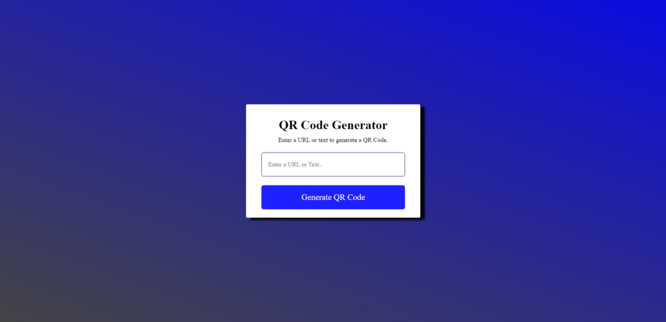
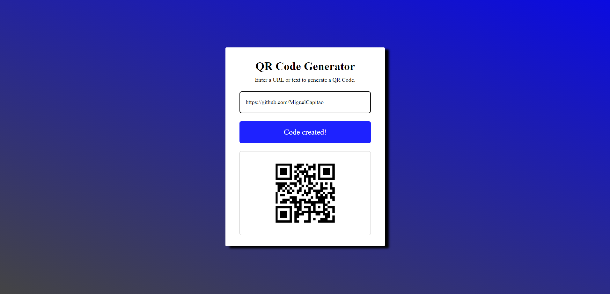

# QR Code Generator

This project was undertaken to strengthen my skills in HTML, CSS, and JavaScript.

## Project Structure
- **index.html:** Contains the html structure.
- **styles.css:** Style file to enhance the visual presentation.
- **scripts.js:** Contains all logic.

## How to use:
1. Clone the repository: `git clone https://github.com/MiguelCapitao/QR-Code-Generator.git`
2. Navigate to the project directory: `cd QR-Code-Generator`
3. Open the `index.html` file in your browser.
  

# Project:
(Upon converting to GIF, the image quality significantly degraded. Apologies for that)

 

